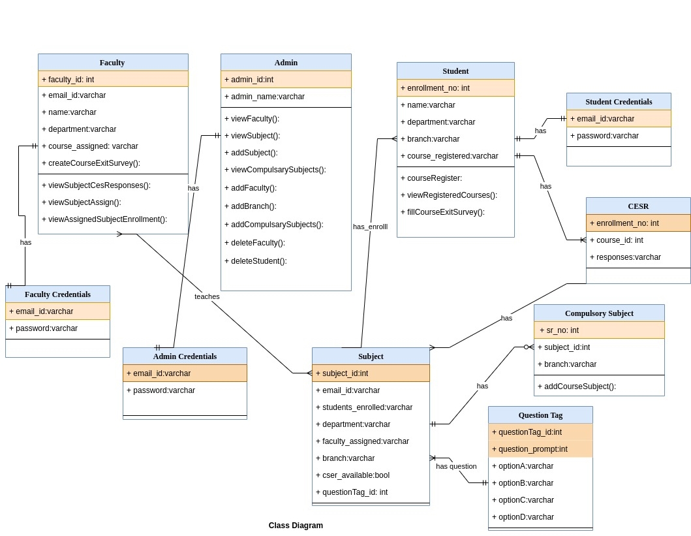
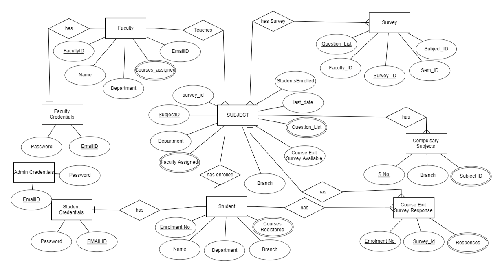

# PG Accreditation Automation

[Contributor's guidelines](notes/Contributors_guidelines.md)

## Get scripts after clone
📜 `npm install react-scripts --save`
## Available Scripts

In the project directory, you can run:

### `npm start`

Runs the app in the development mode.

Open [http://localhost:3000](http://localhost:3000) to view it in your browser.

The page will reload when you make changes.

You may also see any lint errors in the console.

 

This project was bootstrapped with [Create React App](https://github.com/facebook/create-react-app)

## Introduction

At the end of the course session, one must properly solicit feedback from the enrolled students to improve the course structure and outcomes. For this reason, there is a requirement for a simple and hassle-free application that will allow faculty to post the course exit survey. Alongside supporting Automation (Opening and Closing of Course Exit Survey automatically instead of faculty doing it manually) and students to fill out the Course Exit Survey accordingly. Our project’s principal objective is to make this task uncomplicated and simple. To help students and faculty better understand the course experience and outcomes, aim of this project is  to develop an online PG Accreditation Course Exit Survey and Course Survey application.

---

### `npm test`

Launches the test runner in the interactive watch mode.\
See the section about [running tests](https://facebook.github.io/create-react-app/docs/running-tests) for more information.

### `npm run build`

Builds the app for production to the `build` folder.\
It correctly bundles React in production mode and optimizes the build for the best performance.

The build is minified and the filenames include the hashes.\
Your app is ready to be deployed!

See the section about [deployment](https://facebook.github.io/create-react-app/docs/deployment) for more information.

## Learn More

You can learn more in the [Create React App documentation](https://facebook.github.io/create-react-app/docs/getting-started).

To learn React, check out the [React documentation](https://reactjs.org/).

Made with 
